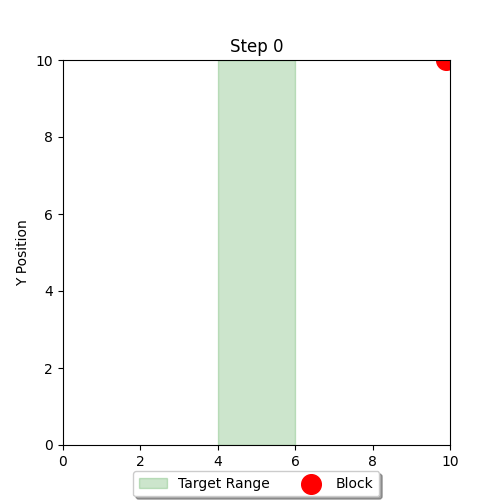
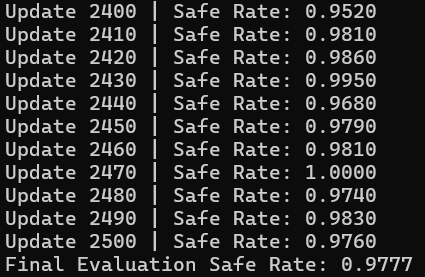

# Group-Relative-Policy-Optimization
Group Relative Policy Optimization

# 问题描述
假设有一个二维的环境，左边界𝑥_𝑙𝑒𝑓𝑡=0，右边界𝑥_right=10，高度ℎ=10。地面位置(ℎ=0)分为安全区域和危险区域，安全位置的左边界𝑙𝑒𝑓𝑡=4，右边界𝑟𝑖𝑔ℎ𝑡=6，其余均为危险区域。

有一个智能体方块，从指定高度(ℎ=10)的某个随机水平位置开始，每次下降一个单位，下降过程中智能体每次只有两种选择，向左或者向右移动一个单位。下降过程不能越界，但仍可继续决策。最终目标是落在安全区域。

<div align="center">
  
</div>

状态空间：方块的水平和竖直坐标(𝑥, 𝑦)，有无数种可能状态。

动作空间：向左移动一个单位，或向右移动一个单位。

策略网络：采用三层MLP网络，输入归一化后的水平和竖直坐标，网络输出决策概率，是一个二维的向量。

奖励机制：分为过程奖励和结果奖励。过程奖励：奖励初始化为0，如果此时水平位置在(4.0, 6.0)内，则奖励加0.2，否则减0.1；将水平位置和5.0（目标区域的中心）的绝对值视为距离，奖励值减去0.05倍的距离；最后引入时间惩罚，奖励值减去0.1，促使智能体尽可能在较短的步骤内实现预期目标。结果奖励：如果水平位置在(4.0, 6.0)内，则奖励为10.0；否则为-10.0 。


# 代码运行

由于该问题和LLM稍有区别，因此基于GRPO算法做了如下处理：

(1) 原始GRPO算法，参考模型(Ref Model)是直接加载经过SFT训练好的权重的，在训练过程参考模型(Ref Model)的参数始终不变。而在这里我们并没有初始的预训练权重，索性每隔一段时间将决策网络(Actor Model)的权重赋值给参考模型(Ref Model)，其余时刻参考模型(Ref Model)的参数始终不变。

(2) 原始GRPO算法，奖励模型(Reward Model)只对最终生成的Response进行打分，只有结果奖励没有过程奖励。而在这里我们采用基于规则的奖励方式，同时包含过程奖励和结果奖励。


```bash
python train.py  # 训练决策网络
python test.py   # 可视化智能体决策效果  
```

决策网络
```
class Actor(nn.Module):
    def __init__(self, state_dim, action_dim, hidden_size=128):
        super(Actor, self).__init__()
        self.net = nn.Sequential(
            nn.Linear(state_dim, hidden_size),
            nn.ReLU(),
            nn.Linear(hidden_size, hidden_size),
            nn.ReLU(),
            nn.Linear(hidden_size, action_dim),
            nn.Softmax(dim=-1)
        )

    def forward(self, x):
        return self.net(x)
```

智能体交互
```
class DropBlockEnv:
    def __init__(self):
        self.x = None
        self.y = None
        self.reset()

    def reset(self, fixed_x=None):
        self.y = INITIAL_HEIGHT
        if fixed_x is not None:  # 允许指定初始x坐标, 因为GRPO需要对同一个prompt采样多个response, 作为一组
            self.x = np.clip(fixed_x, X_BOUNDS[0], X_BOUNDS[1])
        else:
            self.x = np.random.uniform(X_BOUNDS[0], X_BOUNDS[1])
        return self._get_state()

    def _get_state(self):
        return np.array([self.x / X_BOUNDS[1], self.y / INITIAL_HEIGHT], dtype=np.float32)

    def step(self, action):
        new_x = self.x + (1.0 if action else -1.0)
        new_x = np.clip(new_x, X_BOUNDS[0], X_BOUNDS[1])
        self.y -= 1.0
        self.x = new_x

        done = self.y <= 0
        reward = self._calculate_reward(done)
        return self._get_state(), reward, done, {}

    def _calculate_reward(self, done):
        if done:
            return 10.0 if TARGET_RANGE[0] <= self.x <= TARGET_RANGE[1] else -10.0

        distance = abs(self.x - np.mean(TARGET_RANGE))
        in_target = TARGET_RANGE[0] <= self.x <= TARGET_RANGE[1]
        return (0.2 if in_target else -0.1) - 0.05 * distance - 0.1
```


# 实验结果

实验设置：总共迭代2500次，每次迭代采样10组，每组包含4条轨迹，这些轨迹的初始状态就相同，即都是从同一个二维坐标点开始运动的，利用该批采样的数据更新4次参数。

在计算每个状态动作对的优势值时，我们按分组思想，对相同时间步位置的奖励进行归一化，并通过累积折扣回报得到优势值。

<div align="center">
  
</div>

实验结果显示，当网络参数随机初始化时，轨迹的成功率为14.84%；而当训练结束后，轨迹的成功率为97.77%。

<div align="center">
    <a href="./files/output.mp4">点击观看视频</a>
</div>
